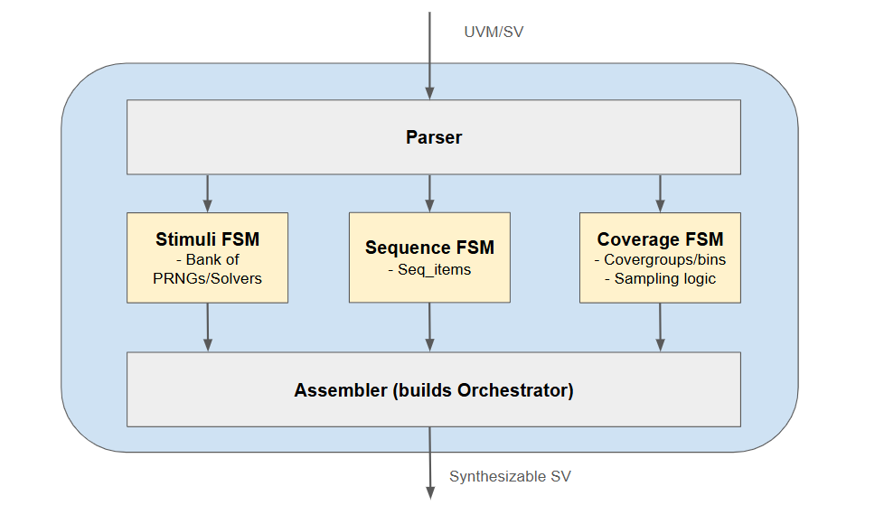

# uvm_synthesis
UVM synthesis project started in Jan 2026 at CMU.

The goals is to emulate a UVM-based testbench, meaning that the code is made synthesizable and can be deployed to an FPGA.

## Schematic


**NOTE**: Refer to [workflow.md](./workflow.md) for latest workflow plans on how everything connects and executes together.

## Directories
1. Examples of UVM code: [uvm_samples](./uvm_samples/)
2. Everything stimuli-related: [stimuli](./stimuli/)
3. Everything coverage-related: [coverage](./coverage/)
4. Everything parser-related: [parser](./parser/)
5. Everything assembler-related: [assembler](./assembler/)

## Usage
Use the uv package manager for handling python packages and virtual environments
1. Install uv in [this link](https://docs.astral.sh/uv/getting-started/installation/)
2. After cloning the repo, run:
```
uv sync
```
3. To run specific python scripts, run:
```
uv run <script.py>
```
> **Note**: To add more python packages to the environment, run
> ```
> uv add <module>     # for example, `uv add pandas`
>
> # Then push changes to remote
> git add uv.lock pyproject.toml
> git commit -m "Added new packages"
> git push -u origin main
> ```