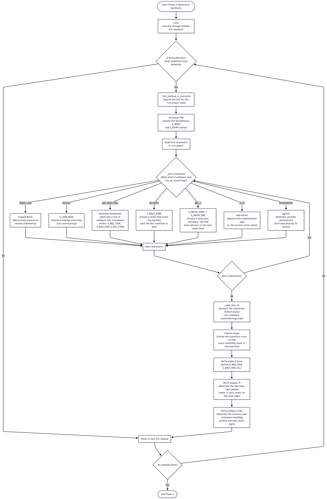
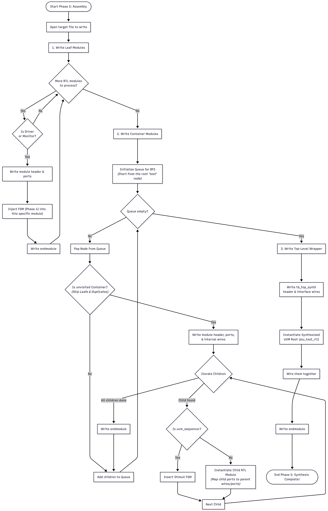

# UVM Synth Assembler
This folder contains the Assembler for this project. The assembler iterates through the hierarchical Abstract Syntax Tree (AST) generated by the parser to emit complete hardware descriptions, including FSMs, container wiring, and top-level wrappers.

## Architectural Overview
The translation process is divided into five phases:

* Phase 1 (Parsing & Analysis)
  Scans the UVM source code to classify components and build a symbol table of classes, methods, and interfaces. [this part is kind of overlapping with parser]
* Phase 2 (Virtual Elaboration)
  Traverses the `build_phase` methods in the AST tree to unroll the instantiated virtual components.
* Phase 3 (Connectivity Analysis)
  Propagates virtual interfaces and generates the structural netlist wiring needed to connect containers like drivers and sequencers.
* Phase 4 (Behavioral Synthesis)
  Translates the sequential software tasks of the `run_phase` into equivalent hardware FSMs.
* Phase 5 (Code Generation)
  Traverses the fully elaborated and synthesized data structures to emit the final synthesizable SV.

## Flowchart Diagram of logic
1. phase 1 Flowchart
  
2. phase 2 Flowchart
  
3. phase 3 Flowchart
  
4. phase 4 Flowchart

  Currently the Sequence FSM is not using token manager and is doing next seq_item -> next seq_item -> ...,
  and I hardcoded Sequence FSM to have the following states, assuming DUT takes 1 clock cycle:

  ```sv
  typedef enum logic [3:0] {
        S_RESET, 
        S_ENTRY, 
        S_LOOP_HEAD, 
        S_REQ_ITEM, 
        S_WAIT_RSP, 
        S_GOT_ITEM, 
        S_DRIVE_START, 
        S_DRIVE_END, 
        S_WAIT_DONE
      } state_t;
  ```

  
5. phase 5 Flowchart
  

## Usage
```bash
python3 assemble.py --input path/to/uvm_src --output path/to/sv_out
```

## How to Run (Current State)

> **Note:** The `--input` and `--output` flags in the Usage line above are not yet implemented. The input directory and output filename are currently hardcoded in `assembler.py`. To run the assembler:

```bash
cd assembler
python3 assembler.py
```

The input directory defaults to `./stress_example1_parsed/`. To switch examples, change `json_dir` near the bottom of `assembler.py`:

```python
json_dir = "./stress_example2_parsed/"  # change this line
```

Output is always written to `rtl_example1.sv` in the current directory regardless of which example is used. *(See Known Issues below.)*

## Input Format

The assembler reads a directory of JSON files, one per UVM component. The expected files are:

| File | Contents |
|------|----------|
| `drv.json` | Driver component (base_type: `uvm_driver`) |
| `mon.json` | Monitor component (base_type: `uvm_monitor`) |
| `agt.json` | Agent component (base_type: `uvm_agent`) |
| `env.json` | Environment component (base_type: `uvm_env`) |
| `tst.json` | Test component (base_type: `uvm_test`) |
| `seq.json` | Sequence items and sequences |
| `itf.json` | Interface definition |
| `cov.json` | Coverage subscriber |
| `dut.json` | DUT module |
| `tb_dut.json` | Testbench top |
| `constants.json` | Local parameters |

These JSON files are **hand-authored** for each example — they are not automatically generated by the parser scripts in `parser/`. The JSON schema used here differs from the parser's output format.

## Observed Execution (stress_example1_parsed)

Running on example1 produces the following classification and hierarchy:

```
Drivers:  ['drv']
Monitors: ['mon']
Agents:   ['agt']
Envs:     ['env']
Tests:    ['example1basic']

uvm_test_top : example1basic
  m_env : env
    m_agt : agt
      m_drv : drv
      m_mon : mon
      m_sqr : uvm_sequencer
      m_cov : cov
```

Phase 4 synthesizes FSM logic for `drv` and `mon` only. The sequencer and coverage components are treated as structural containers with no behavioral synthesis.

The generated output `rtl_example1.sv` contains:
- Packed struct typedefs (`req_item_s`, `reset_req_item_s`)
- Interface definitions (`itf`, `seq_drv_if`, `seq_stim_if`)
- Leaf RTL modules (`drv_rtl`, `mon_rtl`)
- Container RTL modules (`agt_rtl`, `env_rtl`, `example1basic_rtl`)
- Top-level wrapper (`tb_synth`)

## Assumptions

- The input JSON directory must contain all expected component files. Missing files may cause silent failures during classification or elaboration.
- Component classification relies on the `base_type` field matching known UVM base class names exactly (e.g., `uvm_driver`, `uvm_monitor`). Custom base types are resolved through a second inheritance-resolution pass.
- The assembler assumes the DUT takes 1 clock cycle per transaction when generating the driver FSM.
- Parameters such as `ADDR_WIDTH`, `DATA_WIDTH`, and `ARRAY_SIZE` are assumed to be defined externally; the assembler uses placeholder values of `99` in generated interface headers.

## Known Issues

- **`--input` / `--output` flags not implemented:** The command in the Usage section does not work. Input directory and output filename are hardcoded. *(Pending fix by author.)*
- **Output filename always `rtl_example1.sv`:** Running on `stress_example2_parsed` still writes to `rtl_example1.sv` and prints `Success! SystemVerilog written to rtl_example1.sv`. The file content does reflect example2's structure, but the filename and log message are incorrect.
- **FSM state mismatch:** The phase 4 flowchart diagram and the state enum listed in this README describe states (`S_LOOP_HEAD`, `S_GOT_ITEM`, `S_DRIVE_START`, etc.) that differ from what is currently emitted by the code (`S_REQ_ITEM`, `S_WAIT_RSP`, `S_DRIVE`, `S_RESPOND`). *(Need to confirm with author which reflects intended current behavior.)*
- **Behavioral synthesis limited to driver and monitor:** Phase 4 only synthesizes FSM logic for leaf components. Sequencer, coverage, and other container components generate structural RTL only.