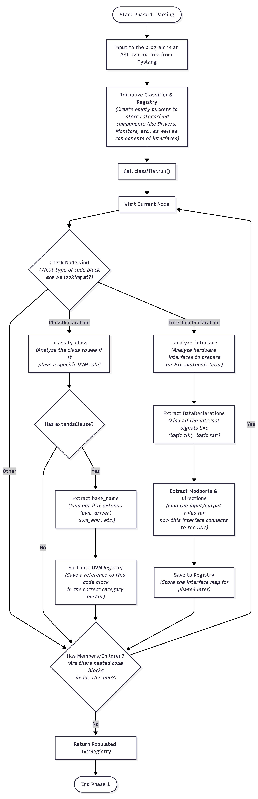
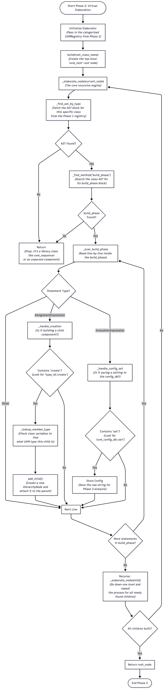
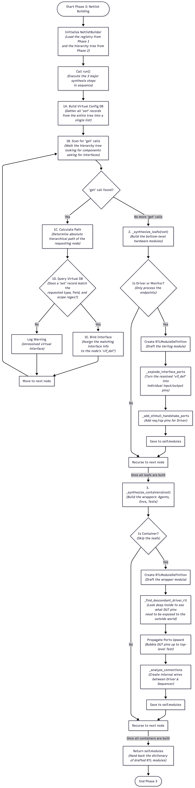

# UVM Synth Assembler
This folder contains the Assembler for this project. The assembler iterates through the hierarchical Abstract Syntax Tree (AST) generated by the parser to emit complete hardware descriptions, including FSMs, container wiring, and top-level wrappers.

## Architectural Overview
The translation process is divided into five phases:

* Phase 1 (Parsing & Analysis)
  Scans the UVM source code to classify components and build a symbol table of classes, methods, and interfaces. [this part is kind of overlapping with parser]
* Phase 2 (Virtual Elaboration)
  Traverses the `build_phase` methods in the AST tree to unroll the instantiated virtual components.
* Phase 3 (Connectivity Analysis)
  Propagates virtual interfaces and generates the structural netlist wiring needed to connect containers like drivers and sequencers.
* Phase 4 (Behavioral Synthesis)
  Translates the sequential software tasks of the `run_phase` into equivalent hardware FSMs.
* Phase 5 (Code Generation)
  Traverses the fully elaborated and synthesized data structures to emit the final synthesizable SV.

## Flowchart Diagram of logic
1. phase 1 Diagram
  
2. phase 2 Diagram
  
3. phase 3 Diagram
  
  
## Usage
```bash
python3 assemble.py --input path/to/uvm_src --output path/to/sv_out
```
