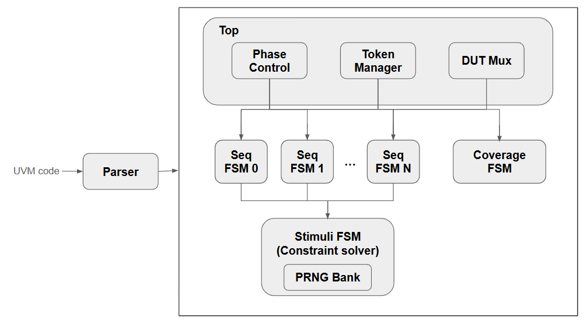

# UVM -> RTL Execution Model

## 1. Architectural Overview
### 1.1 Schematics

TODO: Add image

#### Principles:
- Sequence-centric design: Each sequence-item = independent FSM
- Shared solver: Simuli FSM has a bank of PRNGs which run independently from whole system
- Token-based arbitration: Some concept of a global token where only one sequence drives DUT at a time

### 1.2 Concept of time
**Core principle**: One UVM execution step = One RTL clock cycle

| UVM Construct | RTL Timing | Notes |
| --- | --- | --- |
