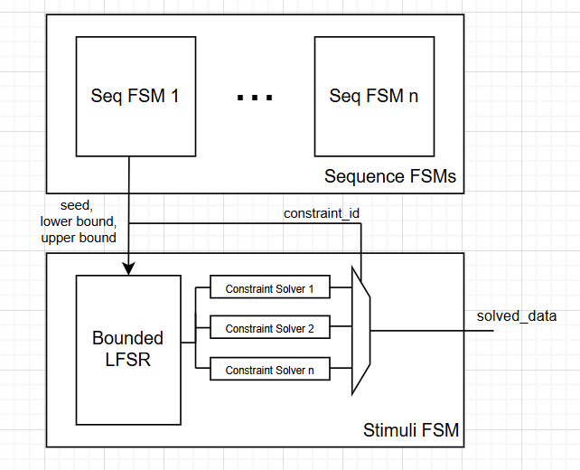

# UVM -> RTL execution flow

## System overview
System generates **3 RTL blocks** (Sequence, Coverage and Stimuli FSMs)  + an **orchestrator block**:


**TODO**: 
- [ ] Will driver and monitor be somewhat static? (i.e. will they change much between designs?) Answer: depending on protocol
- [ ] Will Coverage decide when to stop? Or orchestrator? Or by finishing all sequences? Answer: no (show usage, explort all bins/hits to user)
- Transaction: the lowest level seq_item (research how that looks like? is it signals-ish?)

**Things to look into**:
- [ ] How do we enumerate PRNG bank? how will parser look? how will stimuli FSM work?
Answer: Bounded LFSR for everything (pass in parameters by Seq FSM), have 1-to-1 additional constraint solvers, if required.

## Execution overview
There will be 2 independent workflows:
1. Sequence -> Solver -> Driver interaction
```bash
Step 0: Load seed into Solver FSM
Step 1: Orchestrator grants token to Seq FSM 1
Step 2: Seq FSM 1 executes this loop for its seq_items:
        - Determine next seq_item to execute based on conditional logic
        - Request stimulus data from Solver FSM for that seq_item
        - Issue transaction to Driver
        - Wait for driver to complete transaction
        - Repeat or finish when done
Step 3: Seq FSM 1 signals completion to Orchestrator
Step 4: Orchestrator grants token to next Seq FSM
```
2. Coverage -> Monitor interaction
```bash
Step 1: Coverage FSM determines when to sample events
Step 2: If Coverage FSM decides to sample:
    - Sample transaction from Monitor's observed DUT signals
    - Coverage FSM updates counters/bins based on sampled transaction
Step 3: Repeat until coverage goals are met or test terminates from Orchestrator
```

**Note**: Driver and Monitor should be protocol-aware

## Interface overview
There are 5 handshake protocols/interfaces required:
1. Orchestrator <-> Sequence FSM
2. Sequence FSM <-> Stimuli FSM
3. Orchestrator <-> Coverage FSM
4. Sequence FSM <-> Driver
5. Coverage FSM <-> Monitor

Across all interfaces:
- `ready` / `valid` for data transfter
- `start` / `done` for control
- `token` / `grant` for arbitration

**TODO**:
- [ ] Define handshake within the sequence FSM too? (between sequence <-> seq_item?)

#### Orchestrator <-> Sequence FSM
```systemverilog
interface orch_seq_ifm #(
    parameter int NUM_SEQUENCES = 8
) (
    input  logic clk, rst_n
);
    
    // Orchestrator -> Sequence
    logic [NUM_SEQUENCES-1:0] token_grant;
    logic                     start;

    // Sequence -> Orchestrator
    logic [NUM_SEQUENCES-1:0] done;
    logic [NUM_SEQUENCES-1:0] busy;

endinterface
```

#### Sequence FSM <-> Stimuli FSM


```systemverilog
interface seq_stim_if #(
    parameter DATA_W = 32,
    parameter NUM_CONSTRAINTS = 8
)(
    input  logic clk, rst_n
);
    // Request 
    logic [DATA_W-1:0] seed;
    logic [DATA_W-1:0] lower_bound, upper_bound;
    logic [$clog2(NUM_CONSTRAINTS)-1:0] constraint_id;  // some database of constraints
    logic       req_seed_load;
    logic       req_valid;
    logic       req_ready;

    // Response
    logic [DATA_W-1:0] solved_data;
    logic              rsp_valid;
    logic              rsp_ready;
    
    modport STIM (
        input clk, rst_n,

        // Request
        input seed, lower_bound, upper_bound,
        input constraint_id,
        input req_seed_load,
        output req_ready,
        input req_valid,

        // Response
        output solved_data,
        input rsp_ready,
        output rsp_valid
    );

    modport SEQ (
        input clk, rst_n,

        // Request
        output seed, lower_bound, upper_bound,
        output constraint_id,
        output req_seed_load,
        input req_ready,
        output req_valid,

        // Response
        input solved_data,
        output rsp_ready,
        input rsp_valid
    );

endinterface
```

#### Orchestrator <-> Coverage FSM
```systemverilog
interface orch_cov_if (
    input  logic clk, rst
);

    // Orchestrator -> Coverage
    logic enable;
    logic stop;

    // Coverage -> Orchestrator
    logic        done;
    logic [15:0] coverage_pct; // optional?

endinterface
```

#### Sequence FSM <-> Driver
**TODO**:
- [ ] Are there passive wires for sequence to observe from driver? This is protocol-aware though
Answer: there is mecahnism called driver request and response, research how that looks like

**NOTE**: Include how driver could signal if seq_item should be skipped
```systemverilog
interface seq_drv_if #(
    parameter TX_W = 64
)(
    input logic clk, rst_n
);

  // Request channel
  logic         tx_valid;
  logic         tx_ready;
  logic [TX_W-1:0] tx_payload;

  // Response channel
  logic         rsp_valid;
  logic         rsp_ready;
  typedef enum logic [1:0] {
    TX_OK,
    TX_SKIP,
    TX_ERROR
  } tx_status_t;
  tx_status_t status;

endinterface
```

**TODO**: 
- [ ] Are there passive wires for coverage to observe?

#### Coverage FSM <-> Monitor
```systemverilog
interface cov_mon_if #(
    parameter MON_W = 64
)(
    input logic clk, rst_n
);

  // Monitor -> Coverage
  logic             sample_valid;
  logic [MON_W-1:0] sample_data;

  // Coverage -> Monitor
  logic sample_en;   // tells monitor to snapshot

endinterface
```
