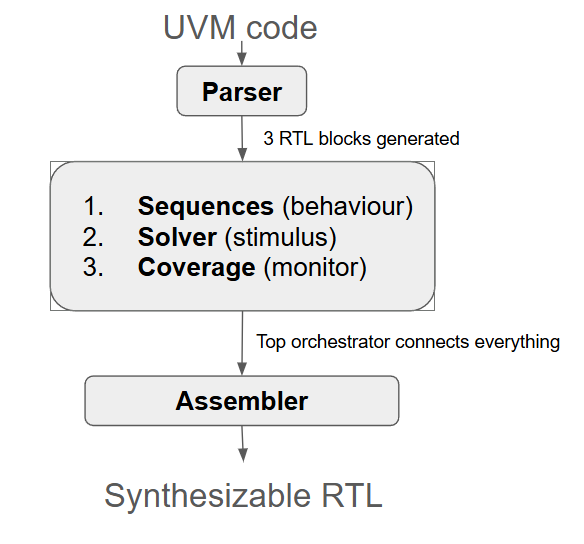

# UVM -> RTL execution flow

## System overview
System generates **3 RTL blocks** (Sequence, Coverage and Stimuli FSMs)  + an **orchestrator block**:



**TODO**: 
- [ ] Will driver and monitor be somewhat static? (i.e. will they change much between designs?)

## Execution overview
There will be 2 independent workflows:
1. Sequence -> Solver -> Driver interaction
```bash
Step 1: Orchestrator grants token to Seq FSM 1
Step 2: Seq FSM 1 executes this loop for its seq_items:
        - Determine next seq_item to execute based on conditional logic
        - Request stimulus data from Solver FSM for that seq_item
        - Issue transaction to Driver
        - Wait for driver to complete transaction
        - Repeat or finish when done
Step 3: Seq FSM 1 signals completion to Orchestrator
Step 4: Orchestrator grants token to next Seq FSM
```
2. Coverage -> Monitor interaction
```bash
Step 1: Coverage FSM determines when to sample events
Step 2: If Coverage FSM decides to sample:
    - Sample transaction from Monitor's observed DUT signals
    - Coverage FSM updates counters/bins based on sampled transaction
Step 3: Repeat until coverage goals are met or test terminates from Orchestrator
```
## Interface overview
There are 5 handshake protocols/interfaces required:
1. Orchestrator <-> Sequence FSM
2. Sequence FSM <-> Stimuli FSM
3. Orchestrator <-> Coverage FSM
4. Sequence FSM <-> Driver
5. Coverage FSM <-> Monitor

**TODO**:
- [ ] Define handshake within the sequence FSM too? (between sequence <-> seq_item?)

#### Orchestrator <-> Sequence FSM
```systemverilog
```

#### Sequence FSM <-> Stimuli FSM
```systemverilog
```

#### Orchestrator <-> Coverage FSM
```systemverilog
```

#### Sequence FSM <-> Driver
**NOTE**: Include how driver could signal if seq_item should be skipped
```systemverilog
```

#### Coverage FSM <-> Monitor