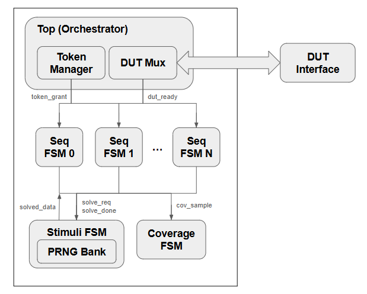

# UVM -> RTL execution flow

## System overview
System generates **3 RTL blocks** + an **orchestrator block**:


The **4 RTL blocks connect as such:


## Execution flow
```bash
Step 1: Orchestrator grants TOKEN to Sequence 0
        │
        ├──→ Seq 0: "I need random data"
        │
Step 2: Seq 0 requests Solver
        │
        ├──→ Solver: Generates random values (5 cycles)
        │
Step 3: Seq 0 receives solved data
        │
        ├──→ Seq 0: Drives transaction to DUT
        │
Step 4: DUT accepts transaction
        │
        ├──→ Seq 0: Triggers Coverage sampling
        │
Step 5: Seq 0 done, releases TOKEN
        │
        └──→ Orchestrator grants TOKEN to Sequence 1
        
        [Repeat for all sequences...]
```

## Top orchestrator
Only **1 sequence** can drive **1 DUT** at a time.

The `token manager` and `DUT mux` work as such:
```bash
┌───────────────────┐            
│ Top Orchestrator  │            
│  (Token manager)  │            
└───┬───────────────┘            
    │token_grant (one-hot)       
    ├────────────┐               
    │            │               
  ┌─▼───┐     ┌──▼──┐            
  │Seq 0│ ... │Seq n│            
  └─┬───┘     └────┬┘            
    └──────┬───────┘            
     ┌─────▼─────┐              
     │ DUT Mux   │              
     └───────────┘               
                                            
```                           
